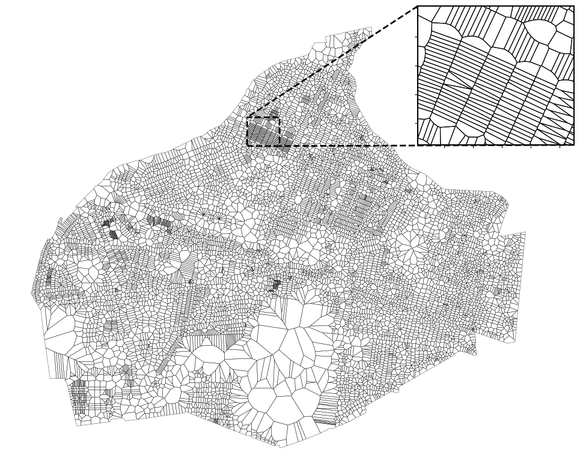

# School boundaries - tessellation of adresses with Voronoi diagrams

This repo shows how to tessellate individual addresses as their own polygon(s). This can be used as neighborhood definition or other geographic delineation/boundary.

Because Voronoi diagrams can extend to infinity, the idea here is to provide administrative boundaries that "clips"/"coerces" Voronoi diagrams within your administrative border of choice. In this project, I use municipalities. Below is an example of Frederiksberg municipality.



## Step 0
Install uv:

Linux/Mac:

```bash
wget -qO- https://astral.sh/uv/install.sh | sh
```

Windows
```bash
powershell -c "irm https://astral.sh/uv/install.ps1 | more"
```

Clone repo:

```bash
git clone https://github.com/jorgenhost/school-boundaries.git
cd school-boundaries
```

And install dependencies with uv:

```bash
uv sync
```


## Step 1

Fetch all adresses:
```bash
curl -L -o data/dk_adresser.ndjson "https://api.dataforsyningen.dk/adgangsadresser?&format=csv"
```

Example with Frederiksberg (kommune=0147 or 147):

```bash
curl -L -o data/dk_adresser.csv "https://api.dataforsyningen.dk/adgangsadresser?kommunekode=0147&format=csv"
```

Fetch shapefiles

```bash
curl -L -o data/admin_boundaries.zip "https://ftp.sdfe.dk/main.html?download&weblink=60a0dc5e27d9561a3d761e876cb2684d&realfilename=DK%5FAdministrativeUnit%2Ezip"

unzip data/admin_boundaries.zip -d data/
rm data/admin_boundaries.zip

```

Then play with it here:
```python
import polars as pl
import polars.selectors as cs

df = pl.scan_csv('data/dk_adresser.csv').collect(engine = 'streaming').with_columns(
    cs.integer().shrink_dtype()
)
df.write_parquet('data/adresser.pq')
```

Or run the two scripts in the `src`-folder:

```bash
uv run src/01_parse_voronoi.py
uv run src/02_plot_voronoi.py
```